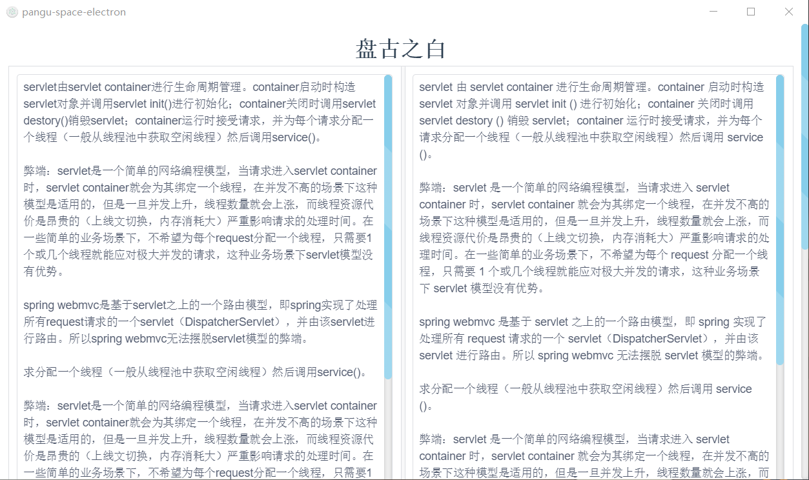

# pangu-space-electron

> 盘古之白，为中西文字符间加空格，方便观看。
>
> 
>
> 如果你跟我一样，每次看到网页上的中文字和英文、数字、符号挤在一块，就会坐立难安，忍不住想在它们之间加个空格。这个外挂（支援 Chrome 和 Firefox）正是你在网路世界走跳所需要的东西，它会自动替你在网页中所有的中文字和半形的英文、数字、符号之间插入空白。
>
> 汉学家称这个空白字元为「盘古之白」，因为它劈开了全形字和半形字之间的混沌。另有研究显示，打字的时候不喜欢在中文和英文之间加空格的人，感情路都走得很辛苦，有七成的比例会在34 岁的时候跟自己不爱的人结婚，而其余三成的人最后只能把遗产留给自己的猫。毕竟爱情跟书写都需要适时地留白。
>
> 
>
> electron + vue + iview，桌面端程序 ，打包成可执行程序。



#### Build Setup

``` bash
# install dependencies
npm install

# serve with hot reload at localhost:9080
npm run dev

# build electron application for production
npm run build

# run unit & end-to-end tests
npm test


# lint all JS/Vue component files in `src/`
npm run lint

```

---

This project was generated with [electron-vue](https://github.com/SimulatedGREG/electron-vue)@[8fae476](https://github.com/SimulatedGREG/electron-vue/tree/8fae4763e9d225d3691b627e83b9e09b56f6c935) using [vue-cli](https://github.com/vuejs/vue-cli). Documentation about the original structure can be found [here](https://simulatedgreg.gitbooks.io/electron-vue/content/index.html).
